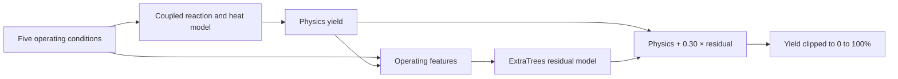
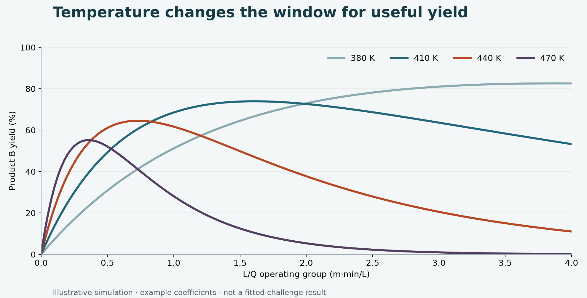

# Reactor Yield Prediction

A model of chemical reactor yield that combines seven fitted physical parameters with an ExtraTrees correction.

[](https://github.com/ashishoutlier/Fugacity_ML_Challenege/actions/workflows/checks.yml)


[Explore the notebook](reactor_yield_final.ipynb) · [Read the presentation](reports/Outliers_Presentation.pdf) · [Technical approach](docs/METHODOLOGY.md) · [Results & evidence](docs/RESULTS.md)

## The problem

In a continuous reactor, producing more of the desired intermediate **B** also exposes it to further conversion into byproduct **C**. Temperature, flow, and heat exchange interact, so the operating point that maximizes yield is not obvious.

This Fugacity 2026 ML challenge project models that tradeoff with a nonisothermal plug flow approximation of **A → B → C**. The reported challenge size is **150 training examples, five operating inputs, and 50 test cases**. The target is the exit yield of B, expressed as a percentage.

The central modeling decision: use the available data to calibrate a small physical model, then train an ExtraTrees regressor on its remaining errors.

## Approach

* **Scientific machine learning:** coupled material and energy balances encode the reaction structure before fitting.
* **Small data modeling:** a 5 → 6 → 7 parameter ablation tests the effect of adding reaction heat terms.
* **Robust optimization:** bounded nonlinear least squares with Cauchy loss and multiple initializations reduces sensitivity to large residuals.
* **Careful evaluation:** cross validation over five folds and two seeds refits the physics within each training fold and compares against an ExtraTrees baseline.
* **Numerical engineering:** vectorized exponential updates use `expm1` to avoid cancellation when reaction rates are tiny.

## At a glance

| Item | Value | Evidence |
| :--- | :--- | :--- |
| Physics model | 7 fitted parameters | Implemented in [reactor_model.py](reactor_model.py) |
| ML correction | ExtraTrees; residual weight λ = 0.30 | Notebook configuration |
| Evaluation design | 5 folds × 2 seeds | Notebook implementation |
| Submitted predictions | 50 values within 0 to 100 | [Original submission](submissions/Outliers.csv) |
| Reported RMSE: ExtraTrees → physics with 5 parameters | 18.09 → 10.76 | Original presentation, slide 5 |
| Reported leaderboard RMSE | 11.2 | Original presentation, slide 5 |

The reported baseline comparison corresponds to a **40.5% reduction in RMSE**. It compares the ExtraTrees baseline with the **five parameter** physics model; it is not a measured improvement for the final hybrid. The leaderboard score is a separate evaluation.

> **Reproducibility status:** the original training/test CSVs and executed experiment outputs were not included in the supplied project. The numerical tests and illustrative demo run without them. Historical scores are attributed to the presentation and have not been independently reproduced. See [results and evidence](docs/RESULTS.md).

## How it works



The physics solver tracks reactant fraction, product fraction, and temperature along the reactor. Two Arrhenius rate laws govern the reactions; jacket exchange and two reaction heat terms couple the temperature back into the kinetics. During training, the tree model learns **observed yield − physics yield**.

The final predictor is:

$$\hat y(x)=\operatorname{clip}\left(y_{\mathrm{physics}}(x)+0.30\,f_{\mathrm{residual}}(x),\,0,\,100\right)$$

## Project website

The site explains the project and lets you change temperature, flow, and reactor length to explore an illustrative yield curve. The complete website source and local setup instructions are in [`website/`](website/README.md). Publication is pending a hosting service issue and confirmation of the intended audience.

## Try it locally

Use Python **3.13**, the version used for the verification environment.

```bash
git clone https://github.com/ashishoutlier/Fugacity_ML_Challenege.git
cd Fugacity_ML_Challenege
python3 -m venv .venv
source .venv/bin/activate
python -m pip install -r requirements.txt
python -m pytest -q
python -m scripts.demo
```

On Windows, activate the environment with `.venv\Scripts\activate`.

The demo saves a CSV and figure to `artifacts/demo/`. It uses **illustrative coefficients**, so it explains model behavior without representing a trained model or a challenge result.



*Illustrative simulation, not experimental data. Horizontal position uses the original notebook's L/Q group; reactor geometry is absorbed into fitted coefficients.*

### Reproduce the challenge workflow

1. Obtain the original challenge inputs and place `train_dataset.csv` and `test_dataset.csv` in `data/raw/`. See the [schema and data instructions](data/README.md).
2. Open [reactor_yield_final.ipynb](reactor_yield_final.ipynb) in VS Code or another notebook editor, select the `.venv` Python kernel, and run all cells from the repository root.
3. Review the numerical diagnostics, ablation, cross validation, and λ sweep before interpreting the generated predictions.

For a headless run:

```bash
mkdir -p artifacts
python -m jupyter nbconvert --to notebook --execute reactor_yield_final.ipynb \
  --ExecutePreprocessor.timeout=-1 --output-dir artifacts --output reactor_yield_executed.ipynb
```

The full fitting and cross validation workflow runs many nonlinear optimizations and may take substantial time. It writes `artifacts/Outliers.csv`, `artifacts/reactor_surrogate.joblib`, `artifacts/parameters.json`, and CSVs for the CV and residual weight results. The original submission remains in `submissions/`.

### Use a trained model

After running the notebook:

```python
import joblib
import pandas as pd
from reactor_model import predict_yield

bundle = joblib.load("artifacts/reactor_surrogate.joblib")
conditions = pd.read_csv("data/raw/test_dataset.csv")
predictions = predict_yield(conditions, bundle)
```

Load only model files you trust. The inference helper validates the input schema and uses the solver settings stored with the model.

## Repository guide

```text
├── reactor_yield_final.ipynb   # Guided analysis, evaluation, and export
├── reactor_model.py           # Importable physics, fitting, and inference
├── scripts/demo.py            # Illustrative simulation without challenge data
├── website/                   # Interactive project website
├── tests/                     # Numerical and inference checks
├── data/README.md             # Input schema and access instructions
├── docs/                      # Methodology, evidence, and interview notes
├── assets/                    # README figures
├── submissions/Outliers.csv   # Original prediction file with 50 rows
├── reports/                   # Original PDF and editable presentation
└── archive/                   # Original notebook, preserved for provenance
```

## Interpretation and limits

The implementation approximates the network as A → B → C; it does not include a direct A → C pathway or axial dispersion. The fitted coefficients are effective parameters, and `L/Q` is a residence time **group**, not a dimensional residence time without reactor geometry.

Raw RMSE is the challenge metric. Dropping the largest 10% of errors gives an additional trimmed diagnostic, not a validated estimate of error against clean labels. Choosing λ on the same CV used for reporting also introduces selection optimism. Physics structure alone does not establish safe extrapolation or suitability for plant control.

The [evidence notes](docs/RESULTS.md) explain which historical claims cannot currently be reproduced, including Bayesian intervals and alternative model comparisons.

## Author

**Ashish Sharma · Team Outliers · IIT Kharagpur**
Fugacity 2026 ML Challenge · [GitHub](https://github.com/ashishoutlier)

For a concise project description and defensible resume bullets, see [the interview brief](docs/INTERVIEW_BRIEF.md).
